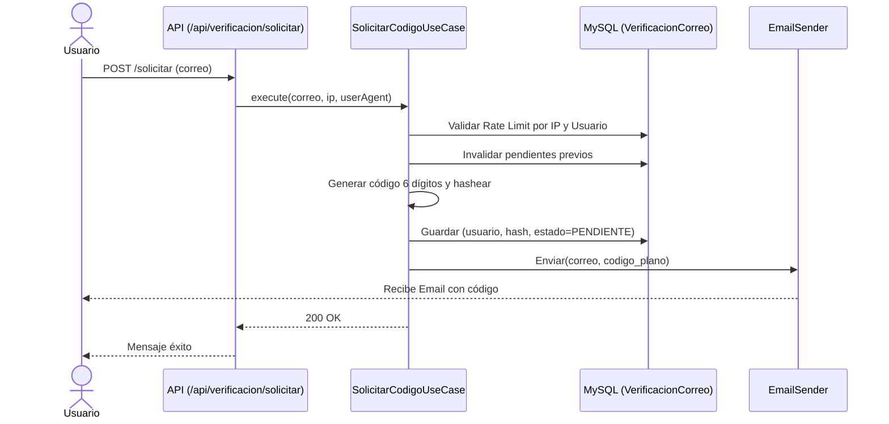

# Sistema de Verificación de Correo (OTP)

## Diagrama de Flujo



## Endpoints

### 1. Solicitar Código
`POST /api/verificacion/solicitar`
**Body:**
```json
{ "correo": "juan@example.com" }
```

### 2. Confirmar Código
`POST /api/verificacion/confirmar`
**Body:**
```json
{
  "correo": "juan@example.com",
  "codigo": "123456",
  "contrasena": "secreta123",
  "confirmarContrasena": "secreta123"
}
```

## Códigos de Error (AppException)

| Código | HTTP | Descripción |
|---|---|---|
| `VALIDACION` | 400 | Campos inválidos (ej. correo malformado) |
| `CODIGO_EXPIRADO` | 400 | Código expiró (15 mins) o no existe |
| `CODIGO_INCORRECTO` | 400 | Hash no coincide |
| `DEMASIADOS_INTENTOS` | 429 | >5 intentos de confirmación o solicitud en <60s |
| `DEMASIADAS_SOLICITUDES`| 429 | Rate limit de IP excedido (3 en 10m, 10 en 1h) |
| `CORREO_YA_VERIFICADO` | 400 | Ya está verificado |
| `CORREO_NO_REGISTRADO` | 404 | Usuario no existe |

